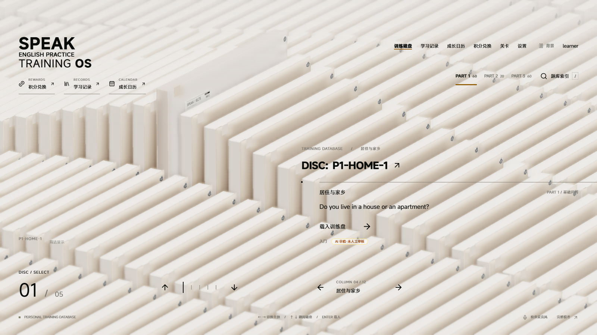
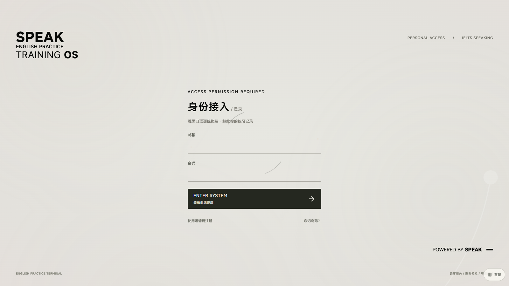
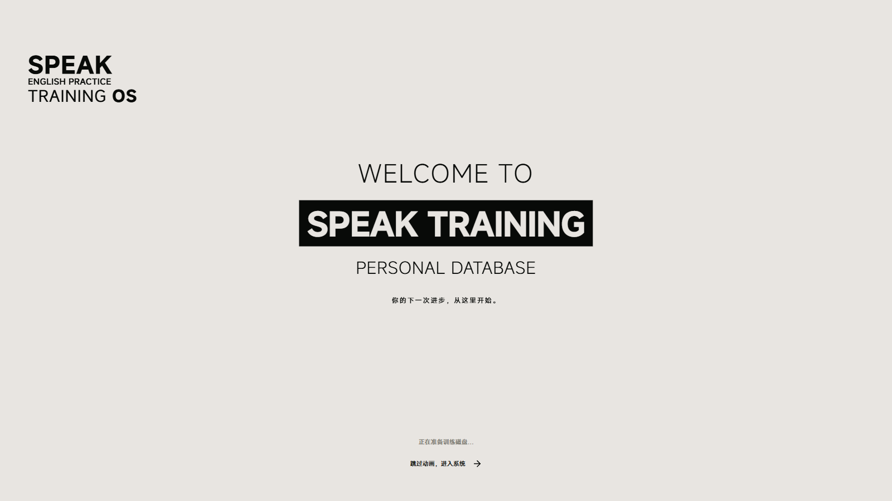
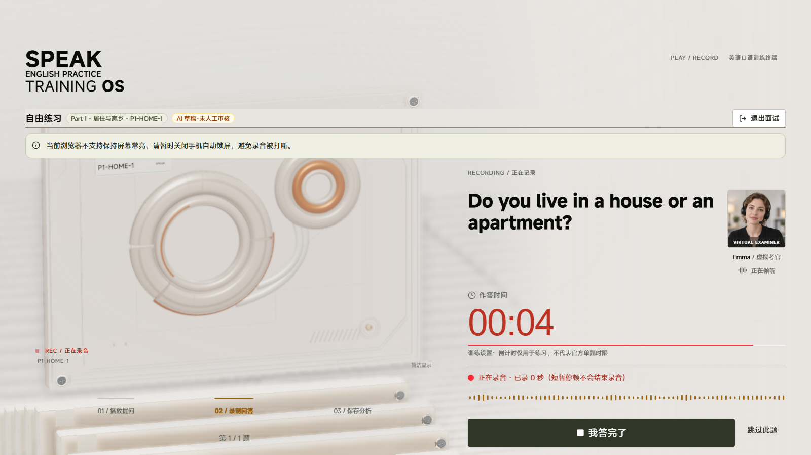
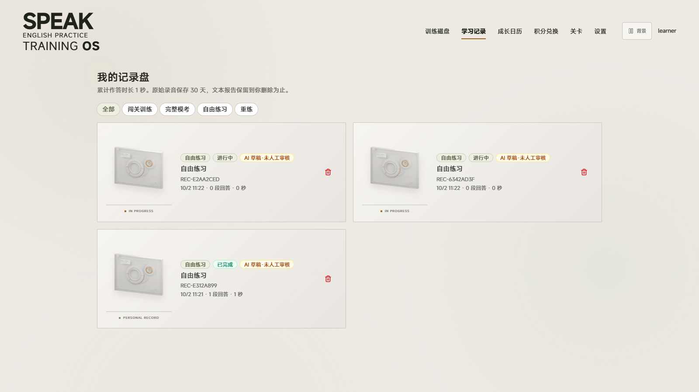
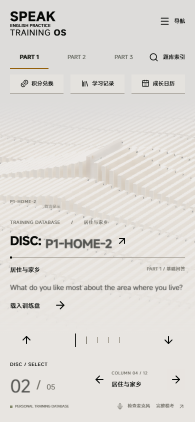
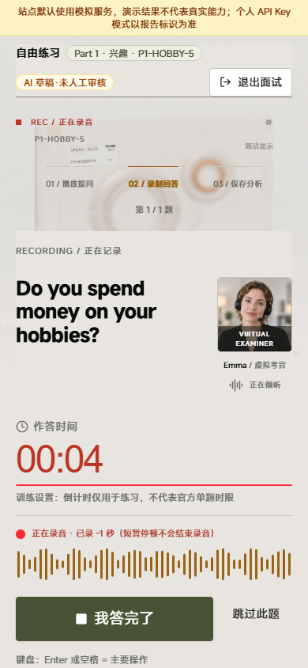
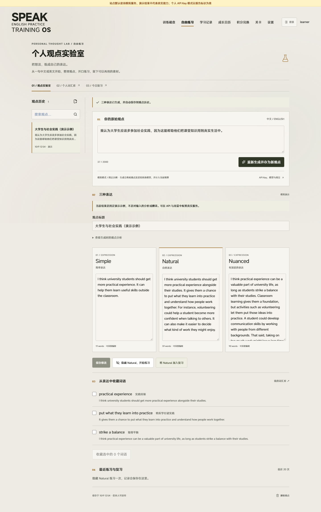
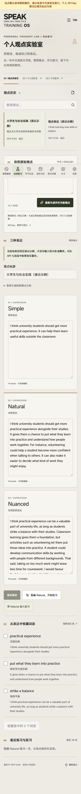

# SPEAK · 雅思口语模拟面试

SPEAK 是面向个人与小范围试用的雅思口语训练 Web 应用。中文导航、英文口语题目，提供虚拟考官、语音播报、麦克风录音、限时作答、反馈报告与重练。

界面采用基于 RhineLabUI 适配的 3D 磁盘终端，支持登录与选盘动画、深浅外观，以及签到积分、分钟券兑换、成长日历和练习统计。支持个人 API Key、模型选择、月预算与调用用量查看。

还包含邀请码注册、首次短体验、复习队列、同题对比、上传进度与中断恢复。详细实施记录见 [签到与成长功能](docs/方案A_实施与验收.md) 和 [学习流程优化](docs/第二轮优化_实施与验收.md)。

**未配置密钥的新安装默认运行模拟服务。** 模拟转写与反馈是演示数据，不代表实际识别或评价你的英语。可在「设置 → API Key、模型与用量」填写自己的百炼北京地域 Key，或由部署者在服务端配置公共 Key。题库是原创 AI 草稿，未经人工审核，不是官方真题。

项目采用 [MIT](LICENSE)；第三方模型、字体与素材的许可见 [THIRD_PARTY_NOTICES.md](THIRD_PARTY_NOTICES.md)。发布前运行 `npm run check:release`，或使用 `npm run export:source` 生成经过检查的源码目录；不要直接打包整个工作目录。详见 [开源发布](docs/开源发布.md)。

项目正在按 [持续优化与产品验收](docs/持续优化与产品验收.md) 推进完整产品交付。该清单记录优先级、每轮证据和仍待真人、真机与恢复演练验证的门槛。

## 界面预览

以下为应用实际页面截图，使用测试账号与示例记录；截图中的倒计时来自加速测试环境。点击图片可查看原图。

**训练磁盘库**：按 Part 和话题浏览题目，选中磁盘后进入练习。

[](docs/screenshots/training-discs.png)

| 身份接入 | 登录欢迎页 |
| --- | --- |
| [](docs/screenshots/login.png) | [](docs/screenshots/welcome.png) |
| **限时口语面试** | **学习记录** |
| [](docs/screenshots/interview.png) | [](docs/screenshots/history.png) |

**手机端**：适配竖屏的磁盘选择与语音作答界面。

| 选择训练磁盘 | 语音面试 |
| --- | --- |
| <a href="docs/screenshots/mobile-discs.png"></a> | <a href="docs/screenshots/mobile-interview.png"></a> |

## Personal Thought Lab · 个人观点实验室

导航中选择 **「自由练习」**，输入中文或英文观点，生成 **Simple / Natural / Nuanced** 三种可编辑英文表达。成功生成会自动保存到个人观点历史，支持搜索、重新修改和重新生成。

隐藏 Natural 后可进行录音回放或尝试写下表达；勾选词语保存到个人词汇库，将 Natural 加入现有「今日复习」，按 1、3、7、14 天积累个人口语素材。编辑 Natural 会同步更新复习卡片，过去的练习保留当时的表达。

保存的观点练习与表达复习也会进入成长日历，可从每日足迹回到观点。观点录音的浏览器时长单独标记，不计入服务器验证的训练录音时长或积分奖励。

未保存的观点和回想文本会在本机暂存 24 小时。刷新或浏览器返回后，可从「本机草稿」恢复；版本有冲突时先核对再保存。草稿不恢复录音、不自动调用模型。退出或切换账号会清除本机草稿与未上传录音，同时通知其他已打开的页面停止录音和上传；浏览器拒绝存储时会明确提示限制。

设置中可撤回录音授权：停止本浏览器各页录音与上传，清除未上传录音，保留文字草稿和已保存记录。后续转写与反馈暂停，重新同意后可手动恢复；旧上传凭证不会重新生效。已发出的调用仍正常记账，发出前取消则释放费用预留。详见 [录音授权与撤回](docs/录音授权与撤回.md)。

生成沿用现有个人 API Key、模型和月预算，并记录 Token 用量；密钥仅在服务端加密保存。练习录音只在当前页面回放，保存时记录时长、自评与可选的尝试文本。模拟模式展示固定示例，不分析或翻译输入。详见 [使用与实现说明](docs/个人观点实验室.md)。

<details>
<summary>查看观点实验室的电脑与手机界面（测试账号、演示结果）</summary>

| 电脑端 · 三种表达与观点历史 | 手机端 · 编辑与词语收藏 |
| --- | --- |
| [](docs/screenshots/thought-lab-desktop.png) | <a href="docs/screenshots/thought-lab-mobile.png"></a> |

</details>

## 个人 API Key、模型和用量

登录后从「设置 → API Key、模型与用量」进入。支持百炼北京地域的 Qwen3 ASR 稳定版 / 2026-02-10 快照和 Qwen Plus / Qwen Flash 非思考模式。保存个人 Key 后用于后续转写、反馈与追问，考官语音沿用站点配置。

密钥在服务端以 AES-256-GCM 加密，接口只返回尾号；不会保存到浏览器 localStorage，也不会写入源码或 `.env`。站点运营者管理服务端，因此只在自己部署或信任的站点填写。删除 Key 后个人模式暂停，不自动回退到公共 Key。

用量页按月份显示录音秒数、输入 / 输出 Token、计费来源、成功与失败状态和估算费用，另显示本应用内月预算与每日录音额度。所有费用均为估算，不包含优惠和其他应用调用，不代表云账户余额。测试连接会产生一次很小的真实反馈模型请求，并记录用量。详见 [个人 API 与用量](docs/个人API与用量.md)。

## 在 Windows 电脑启动

先安装 Node.js 22.12+ 和 FFmpeg，然后获取源码并安装依赖：

```powershell
git clone https://github.com/AncleStar/speak-ielts.git
Set-Location .\speak-ielts
npm ci
npm run setup:voice
```

最方便的方式：双击项目目录中的 **`启动应用.cmd`**。它在后台启动数据库、worker 和网页，检查就绪后打开 `http://localhost:3000/login`。关闭提示窗口不会停止服务；电脑重启后再次双击即可。重复启动会复用本目录已经运行的应用。

若浏览器显示“localhost 拒绝建立连接”，双击 **`查看应用状态.cmd`**；未运行时启动，持续异常时使用 **`重启应用.cmd`**。**`停止应用.cmd`** 只停止本入口管理的服务，保留账号、练习和录音。错误日志在 `data/run/app.err.log`，启动进度在 `app.out.log`。第一次或代码更新后会自动构建，可能需要一分钟。

也可以在终端前台运行：

```powershell
# 在刚才克隆的 speak-ielts 目录中运行
npm run dev:all
```

打开 <http://localhost:3000>。管理员邮箱和初始密码在项目根目录的 `.env` 中查看；首次登录需要修改密码。已有 `.env`、账号、练习记录不会被启动脚本覆盖。首次没有 `.env` 时，`setup:voice` 或启动脚本都会按模板生成随机认证密钥和初始密码，可以先准备自然语音再启动。

完成入门设置的账号登录后会进入「训练磁盘」。上下翻阅同主题题目，左右切换主题；可用鼠标拖拽、滚轮、方向键，或打开「题库索引」搜索。载入训练盘后进入实际限时录音，个人录音可从「我的记录」回放。签到和积分在「SPEAK 首页 / 个人终端」，手机可通过右上角「导航」访问。

磁盘终端基于 [RhineLabUI](https://github.com/LBEILC/RhineLabUI) 的 MIT 代码与模型适配，保留真实账号校验、录音状态和题库数据；原作者及 MiSans 字体许可保留在 `public/licenses/`、`public/fonts/`。源码映射见 [接入说明](docs/design/rhine-disc-v2/源码接入说明.md)，视觉与功能验收见 [design-qa.md](design-qa.md)。设备性能有限时可选「简洁显示」，或在设置中减少动态效果。

启动脚本会检查数据库、必要时在 `data/pg` 启动本机 PostgreSQL 17，执行迁移和题库初始化，随后启动网页和后台 worker。网页或 worker 意外退出时会自动恢复，10 分钟内每个服务最多恢复 3 次；持续失败停止并保留日志。健康检查同时检查数据库与 worker 心跳。已由其他程序启动的数据库只复用。通过上面的终端命令前台运行时，须保持终端打开，按 `Ctrl+C` 停止。

新电脑需要 Node.js 22.12+、FFmpeg；先运行 `npm ci`，再运行 `npm run setup:voice` 下载自然语音模型。依赖和模型第一次安装需要网络，之后考官可以在本机合成语音。没有 Docker 也可以在 Windows 上运行。

使用已编译的正式构建：

```powershell
npm run build
npm run dev:all -- --production
```

手机访问需要 HTTPS；电脑上的 `localhost` 可直接使用麦克风。不能在手机里用 `localhost` 访问电脑。

长期使用建议定期备份。Windows 首次运行 `npm run setup:backup`，随后用 `npm run backup` 保存数据库、私有音频和删除日志。恢复仅允许新空库与新目录，默认保持关闭、停用旧密码；通过 `restore:review` 核对账号、后续费用和配置后，使用新的临时凭据强制改密。个人 Key 需重新填写。详细步骤见 [备份恢复与回滚](docs/备份恢复与回滚.md)。备份和恢复凭据含个人数据，须私密保管，不能上传 GitHub。

## 已实现的功能

- 6 章 30 关：Part 1 基础回答 → 理由与追问 → Part 2 陈述 → Part 3 讨论 → 完整模考。
- 140 道主问题、120 条追问、22 条收尾问题、5 套模考、15 条固定考官用语；每题附中文解释、组织建议、表达和参考回答。
- 虚拟考官状态、英语题目播报、录音音量反馈、逐题倒计时、Part 2 准备和陈述计时。
- 完整模考采用应用内 12 分 30 秒模板，三个部分分别为 270 / 210 / 270 秒；这是练习模板，不是官方逐题限时。
- 首页根据本人的模考历史推荐未练过或最久未练的试卷；选卷页可查看 5 套试卷的尝试次数、完成次数与继续入口。
- 浏览器录音、IndexedDB 暂存、失败重试、私有存储、FFmpeg 转码、静音/停顿分析、转写、结构化反馈与证据校验。
- 音频回放、修正转写、重新生成反馈、参考回答朗读、重练、同题对比、学习记录和记录删除。
- 管理员创建账号、重置密码、停用用户、题库版本与审核发布、考官音频、用量预算和运行状态。
- 管理员在「后台 → 邀请码」生成单次邀请码，可限定邮箱和有效期；受邀人从登录页注册。忘记密码入口说明管理员重置流程，当前不发送恢复邮件。
- 默认每天 30 分钟录音额度、最多 5 个活动会话、月度 AI 预算 100 元；均可在后台调整。
- 录音默认保留 30 天；删除立即撤销访问，worker 清理关联记录；数据库外删除日志用于恢复后的删除重放。

系统不把文本推断当成发音评价，也不宣称提供官方 IELTS 分数。

## 自然考官声音

默认可使用 Kokoro 的 **Emma 英式女声**，语速为正常速度的 95%，句间保留短暂停顿。先运行 `npm run setup:voice`，再打开“设备检查 → 试听考官声音”即可试听。声音独立于转写/反馈配置；启用自然语音不会把模拟转写和反馈变成真实 AI 服务。

```dotenv
TTS_PROVIDER=kokoro
LOCAL_TTS_VOICE=bf_emma
LOCAL_TTS_SPEED=0.95
```

首次运行 `npm run setup:voice` 下载固定版本的约 93 MB 模型到 `data/models/`，并生成 `data/voice-preview/examiner.wav`。面试期间只读取本机模型，不发送题目或录音到云端，不产生语音 API 费用。音频预生成后缓存，首次遇到未缓存的问题可能需等待几秒。

可选音色：`bf_emma`、`bf_isabella`（英式女声）、`bm_george`（英式男声）、`af_heart`（美式女声）。速度范围 `0.8–1.2`。修改后重启网页和 worker，刷新练习页面；已保存的题目和倒计时不会被重置。模型、音色、速度均区分缓存，旧队列不会混入新声音。

`TTS_PROVIDER=auto` 随 `AI_PROVIDER` 使用原有语音服务，`dashscope` 单独启用云语音，`mock` 使用传统系统声音。模型缺失时会提示生成失败，按界面文字继续，不会把提示音当成自然语音。模型来源和音色列表见 [Kokoro 模型说明](https://huggingface.co/onnx-community/Kokoro-82M-v1.0-ONNX)。

## 开启真实转写与反馈

在本机编辑 `.env`，不要把密钥发到聊天或提交进 Git：

```dotenv
AI_PROVIDER=dashscope
DASHSCOPE_API_KEY=你的百炼密钥
TIME_SCALE=1
```

然后执行 `npm run check:providers -- --real`，按 [真实服务与真机验收](docs/真实服务与真机验收.md) 验证。切换后重启网页和 worker，等待后台生成该模型的考官音频。`check:providers` 是小规模真实服务调用，会产生相应用量；它不等于完整质量验收。

## 测试和维护命令

| 命令 | 用途 |
| --- | --- |
| `npm run check:content` | 检查题数、关卡和关联完整性 |
| `npm run typecheck` | TypeScript 检查 |
| `npm test` | 单元与独立 PostgreSQL 集成测试 |
| `npm run build` | 生产构建 |
| `npm run test:e2e` | 用生产构建运行浏览器全流程；请先 build |
| `npm run check:providers` | 检查当前配置下 FFmpeg、TTS、ASR、LLM |
| `npm run check:practice -- --real` | 合成人声与静音走实际上传、转写、反馈服务；沿用现有预算，不算真人质量验收 |
| `npm run check:recovery` | 新建隔离数据库，完整备份恢复后启动实际网页和 worker，验证登录、回放与继续练习；先 build，全部使用模拟服务 |
| `npm run db:migrate` / `npm run db:seed -- --no-tts` | 独立迁移 / 初始化 |
| `npm run setup:backup` | Windows 准备 PostgreSQL 17 便携备份客户端，约 334 MB 首次下载 |
| `npm run check:build-isolation` | 构建后核对全部部署追踪清单，拒绝私有配置、运行数据和工作区外文件 |
| `npm run backup` | 本机完整备份：数据库、私有音频、删除日志和逐文件 SHA-256 |
| `npm run restore -- 备份目录` | 恢复到新建独立空库与新目录；先按恢复文档设置目标，禁止覆盖业务库 |
| `npm run restore:ledger -- 私有文件` | 停止源环境服务后，只读导出费用合计供恢复对账，不覆盖已有文件 |
| `npm run restore:review -- prepare [最新账本文件]` | 生成私有账号、费用及部署检查表，保留默认关闭状态 |
| `npm run restore:review -- approve [检查表文件]` | 通过完整核对后重置登录凭据并补记费用；首次改密，个人 Key 需重填 |
| `npm run replay-deletions` | 恢复旧备份后重放外部删除日志 |

全量集成测试需要 FFmpeg 和 PostgreSQL 17 的 `pg_dump` / `pg_restore`；Windows 先运行 `npm run setup:backup`，其他系统安装对应客户端或配置客户端路径。仅运行纯单元检查可用 `npm run test:unit`。集成测试各自使用独立数据库端口，浏览器测试使用 5545 和网页端口 3100，恢复上线演练使用 5553 和网页端口 3101；均创建新的 `data/verification/` 数据目录，不使用 `.env` 的业务数据库。端口被占用时先确认正在运行的测试，不要停止业务服务。Windows 浏览器测试使用已安装的 Microsoft Edge；其他平台需先 `npx playwright install chromium`。测试虚拟麦克风是合成信号，只验证录音链路；测试专用短提示音不用于正常试用。

## 交付资料

- [验收记录](docs/验收记录.md)：执行结果与尚未验证的环境。
- [第三轮优化](docs/第三轮优化_实施与验收.md)：后台启动、预算恢复、模考选卷与本轮验证。
- [真人与手机验收工作包](docs/验收工作包/README.md)：录音清单、设备验收和首批 30 题人工审核表。
- [部署说明](docs/部署说明.md)：Docker Compose、Caddy、私有 OSS。
- [备份恢复与回滚](docs/备份恢复与回滚.md)：数据保存、删除重放、恢复演练。
- [真实服务与真机验收](docs/真实服务与真机验收.md)：接入与试用门槛。
- [已知限制](docs/已知限制.md)：模拟模式、评分、预算、设备与部署边界。
- [题库与资料来源](docs/题库与资料来源.md)：官方格式依据、原创内容和审核方法。

源码主要位于 `app/`、`components/`、`lib/`；题库在 `content/ielts/`，迁移在 `db/migrations/`，后台入口为 `worker/index.ts`。`data/`、`.env`、录音、测试报告和备份均排除在 Git 与 Docker 构建上下文之外。
