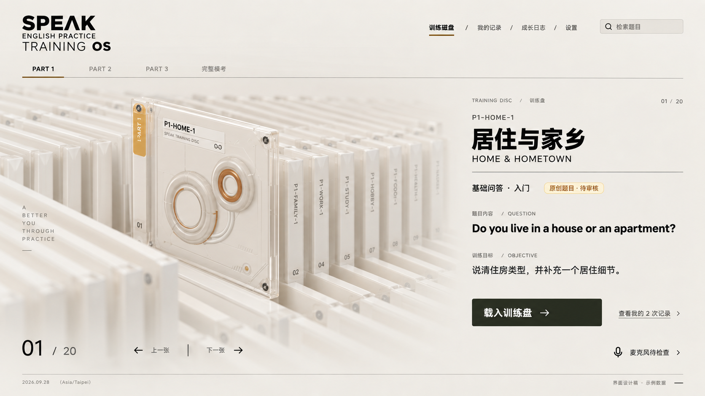
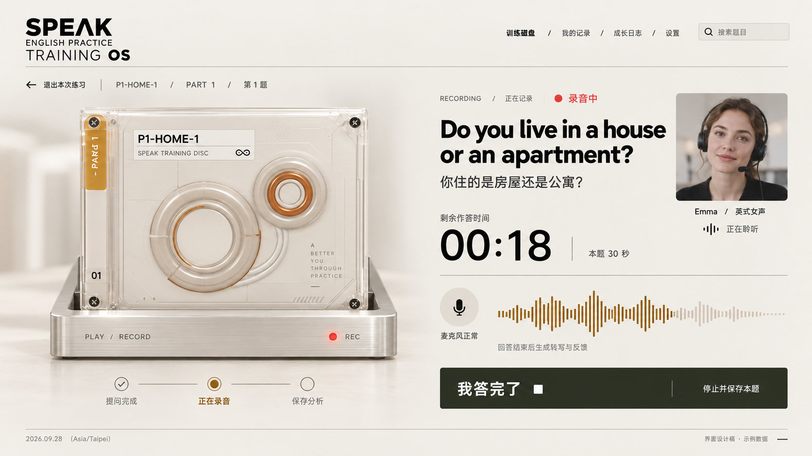
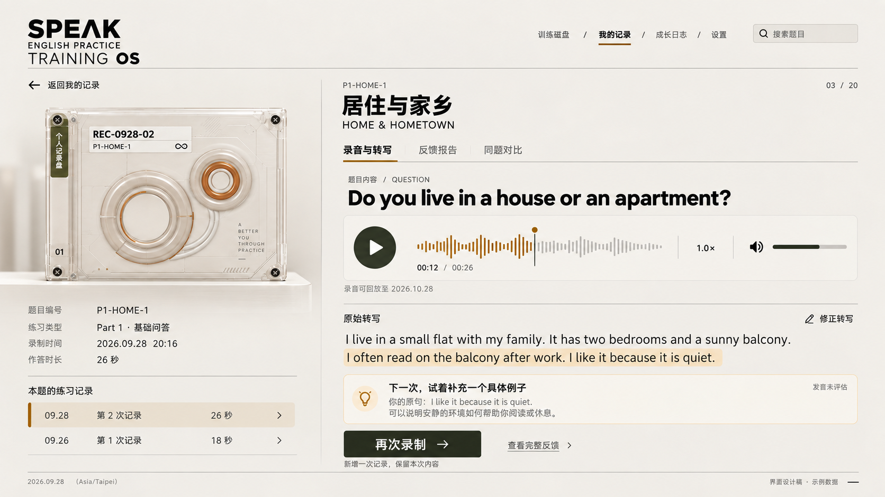
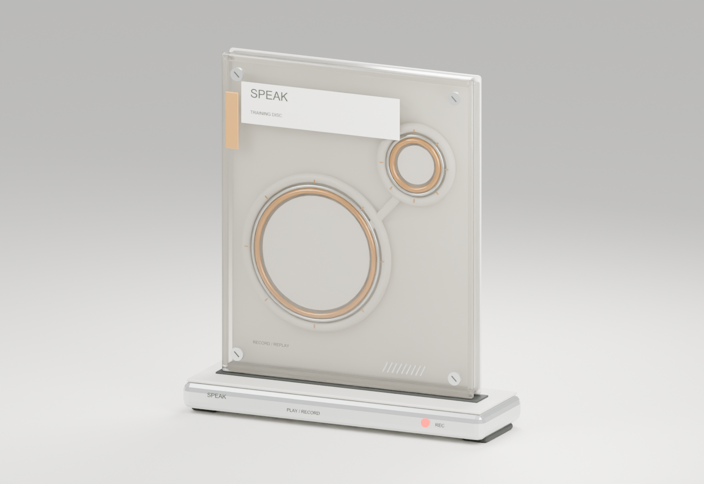

# SPEAK 磁盘训练终端 · 页面设计稿 v1

> 2026-09-29 更新：下方为原始设计阶段记录。三页现已接入实际 App，实施情况见 [接入说明](接入说明.md)，验收结果见 [design-qa.md](../../../design-qa.md)。

2026-09-28。本轮交付为三张同一套视觉风格的页面稿，以及根据用户追加授权制作的 Blender 磁盘资产。图片使用 Image Gen 生成，里面的题号、日期、练习次数和反馈均为示例。实际 App 的页面、账号和练习数据尚未切换。

## 页面稿

### 训练磁盘库

左侧磁盘阵列承载题目浏览，选中后右侧显示题型、难度、训练目标与当前题目。主要按钮「载入训练盘」进入设备检查或面试准备；「查看我的记录」进入这道题自己的历史记录。Part 1、Part 2、Part 3、完整模考作为第一层分类，关卡和难度继续使用现有规则。

主导航：训练磁盘、我的记录、成长日志、设置。日常签到和积分归入个人终端概览，不挤进每一个选题面板。题库检索保留常规文字列表入口，避免必须逐盘翻找。

### 播放录制台

磁盘载入底座，考官提问期间双环转动；开始作答后显示录音灯、输入波形和剩余时间。考官虚拟形象作为通讯窗口出现。录制期的主操作为「我答完了」，结束后必须等录音停止、上传确认，再显示保存完成。

状态顺序：设备待检查 → 载入 → 播放提问 → 准备（题型需要时）→ 录制 → 上传 → 识别与反馈 → 已归档。图中 30 秒只表示这一道示例题的时限，落地时从现有会话计划读取，Part 2 与完整模考按各自规则执行。

动画不驱动计时。录制期关闭背景音乐、减少模型运动；顶部跳转与退出需要防止丢失未上传的作答。中文释义按训练模式显示，模考应遵从既有辅助信息规则。不能把播放器的暂停、拖动和快进入口套到限时面试中。

### 记录回放

个人记录盘使用独立记录编号，与原题编号分开显示。左侧为基础信息与同题多次记录；右侧为录音、转写和反馈。回放支持进度、倍速、音量；「再次录制」新增一条练习记录，保留本次内容。

按题切换转写和引用高亮即可完成首版回放，不把静态文本高亮冒充逐字时间对齐。录音过期后移除音频播放入口，保留“音频已到期”和可查看的文字报告。当前保存政策为录音 30 天，文本到用户删除为止。

## 视觉规范

- 基底：暖灰白与象牙白，深炭黑文字；琥珀色标注训练盘，深橄榄色标注个人记录盘及主要按钮。
- 几何：透明矩形盘体、双环、金属紧固件和底座；细线、留白、对齐优先。
- 字体：可读的无衬线中文与英文；编号/时间少量使用等宽字体。正文不随整体场景缩放到不可读。
- 大屏：磁盘在左，功能内容在右；录制页题目和计时优先；回放页缩小模型、扩大阅读区域。
- 手机：计划采用上方单盘、下方正文与固定主要操作；需要实现后的真机检查，设计图片不是响应式验收。
- 低性能与减少动态效果：保留功能的二维磁盘列表、较低渲染质量、关闭持续背景动作。

## 必须接到真实业务的状态

| 界面状态 | 实际依据 | 显示方式 |
| --- | --- | --- |
| 未解锁 | 关卡/题库权限 | 显示要求与原因，服务端再次校验 |
| 正在录音 | 麦克风录制器实际状态 | 红灯与输入波形；模型动画本身不代表录音成功 |
| 保存中 | 上传与确认结果 | 保存进度；失败可重试；成功前不显示已归档 |
| 处理中 | 后台回答处理阶段 | 转码、转写、反馈的当前步骤 |
| 等待预算恢复 | 已有 budget_wait 状态 | 解释暂停原因，保留手动继续入口 |
| 内容不足 | 现有 insufficient 状态 | 说明原因、允许重新作答 |
| 录音已到期 | 保存期限与实际存储状态 | 停用播放器，保留文本和报告 |
| 历史模拟数据 | 原记录 mock 标识 | 保留演示提示，不转成真实成绩 |
| 发音未评估 | 现有反馈能力 | 保留说明，不生成雅思官方分数 |

## 数据与模型边界

训练盘映射现有题目版本、关卡或模考计划；个人记录盘映射用户自己的会话及回答。使用稳定数据库 ID 关联，盘面编号是展示，不代替鉴权。公共模型不存个人信息；题名、日期、次数等在运行时附加。

Blender 源工程位于 `art/speak-disc/`，网页用文件位于 `public/models/speak-disc/v1/`。本轮制作静态网格和可动画部件；插盘、双环转动、播放进度、录音灯与真实业务的联动留到前端接入阶段。

模型已在本机 Blender 5.2.2 中完成生成和实际渲染，并通过两个 GLB 的重新导入及关键节点检查。资产合计约 1.03 MB；[建模说明与验证范围](../../../art/speak-disc/README.md)。下面是 Blender 实际渲染，与上方生成式页面稿不同：

## 参考与生成记录

- 视觉来源：[LBEILC/RhineLabUI](https://github.com/LBEILC/RhineLabUI)。使用仓库作者发布的 [阵列截图](https://github.com/LBEILC/RhineLabUI/blob/main/docs/media/archive.jpg) 与 [详情截图](https://github.com/LBEILC/RhineLabUI/blob/main/docs/media/detail.jpg) 作为实际图像参考。本轮未声称对在线站点进行过实时浏览器捕获。
- 功能来源：当前项目录音、题库、报告、预算和历史数据结构。旧版报告截图仅用于功能核对。
- 三张稿由内置 Image Gen 工具生成；完整提示词保存在 [PROMPTS.md](PROMPTS.md)。
- Blender 模型由本项目新增脚本程序化生成，未导入上游 GLB；不使用莱茵生命名称、标志、人物或原片音频。

下一步先确认三页布局，再将已制作的 3D 部件接入现有 Next.js 页面与业务状态。
